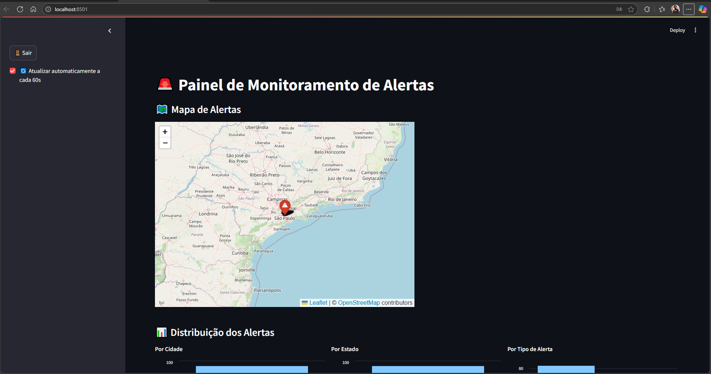
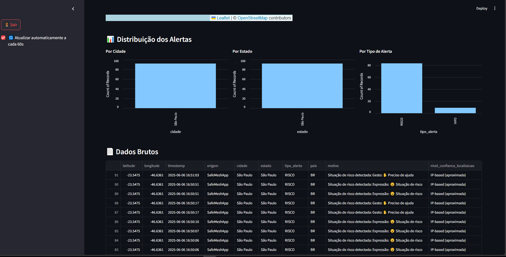
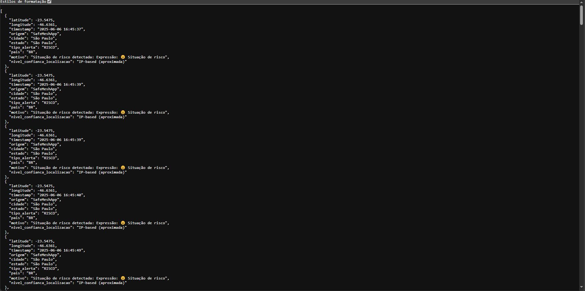

````markdown
# 🛡️ SafeMesh – Painel de Monitoramento de Alertas em Tempo Real

**SafeMesh** é um painel interativo desenvolvido com **Streamlit** para o monitoramento de alertas em tempo real, pensado para auxiliar a **Defesa Civil**, principalmente em situações de emergência como **enchentes, apagões e desastres naturais**.

Integrado com **drones de resgate** e **dispositivos IoT**, o SafeMesh ajuda a localizar pessoas em áreas de risco através de dados georreferenciados, exibidos em tempo real em um painel visual e dinâmico.

---

## 🧩 Descrição do Problema

A resposta a desastres naturais, como enchentes e blecautes, ainda é lenta e desorganizada em diversas regiões. A Defesa Civil precisa de ferramentas inteligentes que auxiliem a **identificação rápida de áreas afetadas** e a **localização de pessoas em risco**, especialmente em ambientes urbanos caóticos e com infraestrutura comprometida.

---

## 🎯 Visão Geral da Solução

O **SafeMesh** visa preencher essa lacuna oferecendo uma plataforma de monitoramento em tempo real:

### Funcionalidades:
- ✅ Autenticação via token JWT com API REST
- ✅ Mapa interativo com marcadores de alertas
- ✅ Gráficos dinâmicos por cidade, estado e tipo de alerta
- ✅ Autoatualização a cada 60 segundos
- ✅ Interface web leve e responsiva
- ✅ Possibilidade de integração com dispositivos móveis, drones e sensores IoT

---

## 📸 Captura de Tela




---

## 🎬 Vídeo Demonstrativo

📺 [Assista à demonstração no YouTube](https://youtu.be/IWIL9I7E2Qs)

---

## 🚀 Como Executar Localmente

### 1. Clone o repositório
```bash
git clone https://github.com/GuiBichaco/SafeMesh_IoT_MediaPipe.git
cd SafeMesh_IoT_MediaPipe
````

### 2. Instale as dependências

Certifique-se de ter o Python 3.9+ instalado.

```bash
Instalar via terminal da aplicação com o "pip install" na frente e as libs abaixo em seguida. Ex: pip install pandas

streamlit
requests
python-dotenv
pandas
streamlit-folium
folium
python-multipart
opencv-python mediapipe numpy requests
opencv-python mediapipe
pybluez
requests geocoder
PySimpleGUI
fastapi uvicorn
fastapi uvicorn python-jose[cryptography] requests
python-multipart
python-jose[cryptography]
streamlit-autorefresh
```

### 3. Execute o aplicativo


ABRIR COM ANACONDA NAVIGATOR 

iniciar o servidor da api:

```bash
uvicorn api_defesa_civil:app --reload --host 127.0.0.1 --port 8000

python MediaPipe.py

streamlit run app.py

```

---

## 🧪 Tecnologias Utilizadas

* [Streamlit](https://streamlit.io/)
* [Folium](https://python-visualization.github.io/folium/)
* [Altair](https://altair-viz.github.io/)
* [Requests](https://docs.python-requests.org/)
* [Pandas](https://pandas.pydata.org/)
* [Python-dotenv](https://github.com/theskumar/python-dotenv)
* [API FastAPI JWT](https://fastapi.tiangolo.com/)

---

## 👥 Integrantes do Projeto

| Nome Completo              | RM        |
| -------------------------- | --------- |
| Guilherme Catelli Bichaco | RM97989 |
| Vinicius Sobreira Borges | RM97767 |


---

## 📫 Contato

Se tiver dúvidas, sugestões ou quiser contribuir, entre em contato:

* ✉️ Email: [guicomercial328@gmail.com](guicomercial328@gmail.com)

---

> “Tecnologia salva vidas. SafeMesh conecta socorro, dados e ação.”

```

